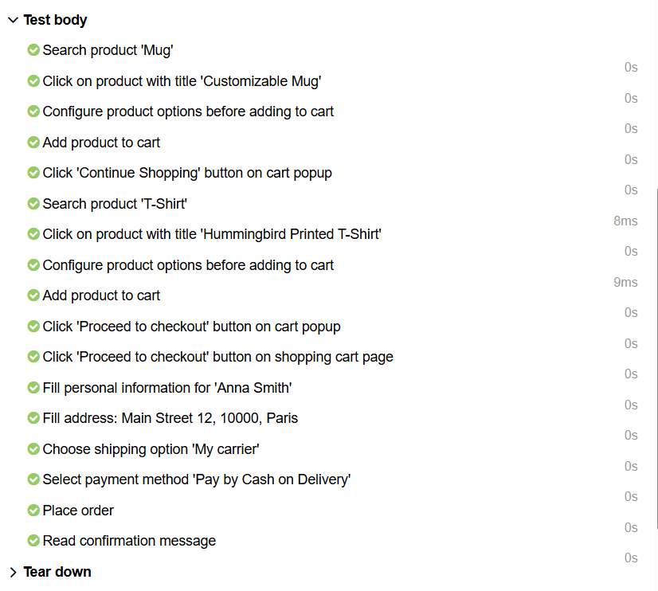
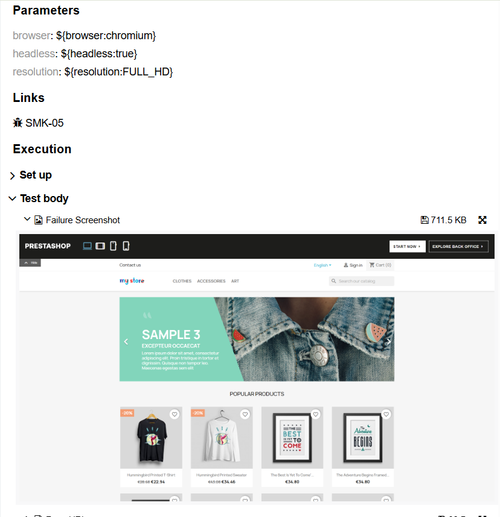
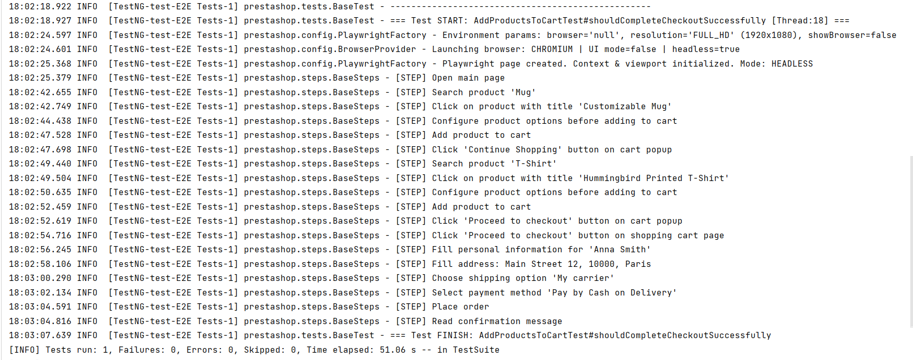

## 📖 Overview
This project is an automated UI testing framework for the [**PrestaShop Demo Store**](https://demo.prestashop.com/#/en/front), built with **Playwright**, **Java**, **TestNG**, and **Allure**.  
It verifies the main user journeys of an e-commerce website — from product browsing and filtering to checkout completion — using a clean, modular architecture.

There is no dedicated **environment** setup (like `dev`, `test`, or `prod`) because the demo site is public and static.  
All tests use the same base URL and focus on UI functionality validation.

---

## 🧱 Architecture

The framework follows a **multi-layered structure** combining **Page Object**, **Steps**, and **Flow** levels:

- **Page** — defines locators and small atomic actions (e.g., `click`, `fill`, `getText`).
- **Steps** — describe business logic: sequences of actions like "search for a product" or "add item to cart".
- **Flow** — represents complete user scenarios, e.g., full purchase or registration flow.
- **Test** — contains assertions (`Assert`, `expect`) and test grouping via **TestNG** (`@Test(groups = {...})`).

This separation makes the tests more readable, reusable, and easy to maintain.

---

## 🚀 Test Execution

Tests are executed using **Maven** and **TestNG** suites.

Example command:
```bash
mvn clean test -DsuiteXmlFile=src/test/resources/suites/testng-smoke.xml -DthreadCount=2
```

You can also pass additional parameters for browser configuration:

| **Parameter** | **Description** | **Example** |
|----------------|-----------------|--------------|
| `-Dbrowser` | Browser type (`chromium`, `firefox`, `webkit`) | `-Dbrowser=firefox` |
| `-Dresolution` | Screen resolution (`FULL_HD`, `HD`, `MOBILE`) | `-Dresolution=FULL_HD` |
| `-Dheadless` | Runs in headless mode (`true` / `false`) | `-Dheadless=false` |
| `-DthreadCount` | Number of parallel threads | `-DthreadCount=3` |

## 🧪 Test Types

| 🧩 **Test Type** | **Description** |
|------------------|------------------|
| **Smoke Tests** | Check critical UI elements such as navigation menus, language dropdowns, and links. |
| **Functional Tests** | Validate page-specific logic — e.g., sorting, search results, registration forms, and price parsing. |
| **End-to-End (E2E)** | Cover a complete purchase flow — from searching for a product to order confirmation. |

## 📊 Allure Reporting

Allure Reports are integrated into the project for detailed and visually rich test reporting.  
After every test run, Allure results are automatically generated inside the `target/allure-results` folder.  
Since tests are executed via `mvn clean test`, the `target` directory is cleaned before each run, ensuring that every report is fresh and relevant.

To view the report locally, you can run:
```bash
allure serve target/allure-results
```

Allure logging exemples:


Each failed test automatically attaches:
A screenshot of the page at the moment of failure
The current page URL
The corresponding log message for easier debugging
This behavior is handled by a custom TestNG listener (TestListener) that integrates Playwright screenshots with Allure attachments.



## 🪵 Logging

The framework includes structured logging using **Logback**.  
Each step, page interaction, and flow is logged in real time, making it easy to trace test execution in the console.  
This helps to track the full flow of actions, such as **navigation**, **input**, **clicks**, and **assertions**.
